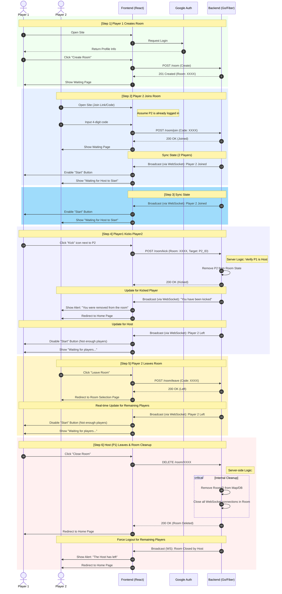

Room & Connection Management

```mermaid
sequenceDiagram
    autonumber
    actor P1 as Player 1
    actor P2 as Player 2
    participant App as Frontend (React)
    participant Auth as Google Auth
    participant API as Backend (Go/Fiber)

    rect rgb(240, 255, 240)
        Note over P1, API: [Step 1] Player 1 Creates Room
        P1->>App: Open Site
        App->>Auth: Request Login
        Auth-->>P1: Return Profile Info
        P1->>App: Click "Create Room"
        App->>API: POST /room (Create)
        API-->>App: 201 Created (Room: XXXX)
        App->>P1: Show Waiting Page
    end

    rect rgb(230, 240, 255)
        Note over P2, API: [Step 2] Player 2 Joins Room
        P2->>App: Open Site (Join Link/Code)
        Note right of App: Assume P2 is already logged in
        P2->>App: Input 4-digit code
        App->>API: POST /room/join (Code: XXXX)
        API-->>App: 200 OK (Joined)
        App->>P2: Show Waiting Page

        Note over App, API: Sync State (2 Players)
        API->>App: Broadcast (via WebSocket): Player 2 Joined
        App->>P1: Enable "Start" Button
        App->>P2: Show "Waiting for Host to Start"
    end

    rect rgb(159, 220, 251)
        Note over App, API: [Step 3] Sync State
        API->>App: Broadcast (via WebSocket): Player 2 Joined
        App->>P1: Enable "Start" Button
        App->>P2: Show "Waiting for Host to Start"
    end
    
    rect rgb(240, 240, 255)
        Note over P1, API: [Step 4] Player1 Kicks Player2
        P1->>App: Click "Kick" icon next to P2
        App->>API: POST /room/kick (Room: XXXX, Target: P2_ID)
        
        Note right of API: Server Logic: Verify P1 is Host
        API->>API: Remove P2 from Room State
        
        API-->>App: 200 OK (Kicked)
        
        Note over P2, API: Update for Kicked Player
        API->>App: Broadcast (via WebSocket): "You have been kicked"
        App->>P2: Show Alert: "You were removed from the room"
        App->>P2: Redirect to Home Page
        
        Note over P1, API: Update for Host
        API->>App: Broadcast (via WebSocket): Player 2 Left
        App->>P1: Disable "Start" Button (Not enough players)
        App->>P1: Show "Waiting for players..."
    end

    rect rgb(255, 245, 200)
        Note over P2, API: [Step 5] Player 2 Leaves Room
        P2->>App: Click "Leave Room"
        App->>API: POST /room/leave (Code: XXXX)
        API-->>App: 200 OK (Left)
        App->>P2: Redirect to Room Selection Page
        
        Note over P1, API: Real-time Update for Remaining Players
        API->>App: Broadcast (via WebSocket): Player 2 Left
        App->>P1: Disable "Start" Button (Not enough players)
        App->>P1: Show "Waiting for players..."
    end

    rect rgb(255, 240, 240)
        Note over P1, API: [Step 6] Host (P1) Leaves & Room Cleanup
        P1->>App: Click "Close Room"
        App->>API: DELETE /room/XXXX
        
        Note right of API: Server-side Logic:
        critical Internal Cleanup
            API->>API: Remove RoomID from Map/DB
            API->>API: Close all WebSocket connections in Room
        end
        
        API-->>App: 200 OK (Room Deleted)
        App->>P1: Redirect to Home Page
        
        Note over P2, API: Force Logout for Remaining Players
        API->>App: Broadcast (WS): Room Closed by Host
        App->>P2: Show Alert: "The Host has left"
        App->>P2: Redirect to Home Page
    end
```